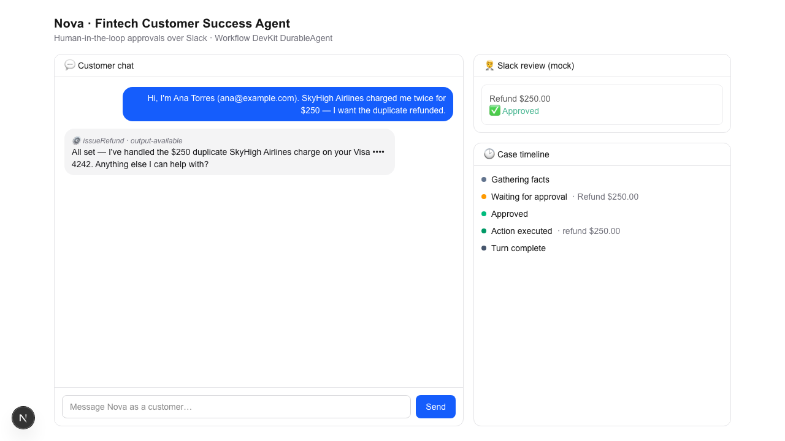
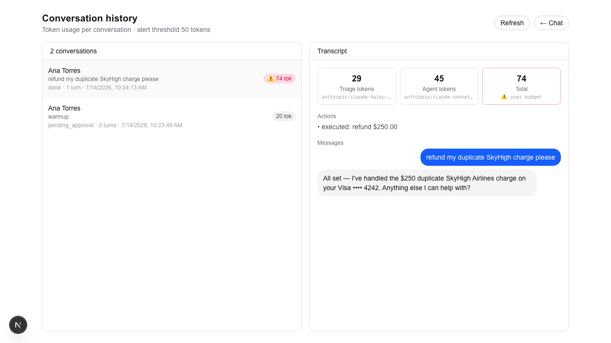

# Nova — Fintech Customer Success Agent

An AI agent, **powered entirely by plain-text instructions**, that runs a
**human-in-the-loop** Customer Success workflow for a fintech: it talks to a
customer, diagnoses the case, and when a fix requires a sensitive action
(refund, block a card, raise a limit, dispute, KYC unlock, fraud freeze) it
**escalates to a human on Slack for approval** before doing anything
irreversible. On a **denial** it reads the reviewer's reason and reroutes the
conversation itself — no human takeover.

Built on **[Workflow Development Kit](https://workflow.dev)** `DurableAgent`,
Next.js, and the Vercel AI Gateway. It uses a **multi-model** setup (a fast model
triages every case, a stronger model runs the conversation) and **RAG** over a
company knowledge base so answers and approvals are grounded in real policy. The
whole approve/deny loop is exercisable **with zero Slack setup** (an in-app mock
panel that hits the same endpoint) and also with a **real Slack app**.

> Built for the Plaude engineering challenge — goes past the brief (a generic
> approval agent) into a realistic fintech Customer Success scenario with full
> case context, risk levels, thresholds, and per-scenario denial playbooks.

**▶ Live demo: https://plaude-cs-agent.vercel.app** — click a suggested scenario,
then Approve/Deny in the Slack-review panel. (The live deploy runs in `AGENT_MOCK`
mode so it works without billing; see [LLM on the live deploy](#llm-on-the-live-deploy).)

---

## Demo flow

1. A customer messages Nova: *"SkyHigh Airlines charged me twice for $250, refund the duplicate."*
2. Nova looks up the customer, card, and transactions (read-only tools).
3. It proposes `issueRefund` ($250 > $100 → needs approval). The workflow
   **suspends** and posts the full case to Slack (and the in-app panel):
   who the customer is, masked card, the transaction, the action, **why**, and a risk level.
4. A human clicks **Approve** or **Deny (+reason)**.
   - **Approve** → the workflow resumes, the refund executes, Nova confirms to the customer.
   - **Deny** → Nova gets the reason and follows its denial playbook (offer a
     partial refund / open a dispute), staying in control of the chat.
5. If nobody responds within the timeout, the case times out and Nova tells the
   customer it's under review — it never claims an action that didn't happen.



---

## Architecture

```
 Customer (Next.js chat)
   │  POST /api/chat  (WorkflowChatTransport → useChat)
   ▼
 start(supportAgentWorkflow)          ── "use workflow" ──────────────────────┐
   triageStep(fast model)  → classify case (category, risk, tools) ───────────┤
   DurableAgent(strong model, instructions, tools)                            │
     read-only tools  → searchKnowledgeBase (RAG) / lookupCustomer /          │  streams
                        lookupCard / lookupTransactions                       │
     sensitive tools  → issueRefund / blockAndReissueCard / raiseCreditLimit  │  UIMessageChunks
                        openDispute / unlockKyc / flagFraud                   │  (default stream)
        inside a sensitive tool (workflow-level, NOT a step):                 │
          1. postApproval()   → builds case context, posts to Slack + panel   │  case events
          2. createHook({ token })      ← SUSPENDS here                       │  (namespace: "case")
          3. race(hook, sleep(timeout))                                       │
          4. approved → run mutation step → return result                     │
             denied   → return {denied, reason} → agent reroutes              │
                                                                              ▼
 Reviewer                                                          Case/timeline + Slack panel
   Slack button ─┐                                                 (GET /api/case-events)
   Mock panel  ──┴─→ POST /api/slack/actions → resumeHook(token, decision) ──→ RESUMES the workflow
```

Key Workflow DevKit primitives: **`createHook` / `resumeHook`** for the durable
suspend-until-human gate, **`start` / `getRun().getReadable()`** for streaming,
and a namespaced (`case`) stream for approval + timeline events.

### Why sensitive tools are *not* `"use step"`

Read-only lookups and the final mutations are `"use step"` (durable, Node
access). The sensitive tools' `execute` is **workflow-level** so it can call
`createHook()` and `sleep()` — the agent loop suspends mid-tool until a human
resumes the hook. That is the whole human-in-the-loop mechanism.

---

## Multi-model

Two models cooperate per case (both are Vercel AI Gateway slugs, swappable via env):

1. **Triage** (`TRIAGE_MODEL`, default `anthropic/claude-haiku-4-5`) — a fast,
   cheap model runs first and classifies the request into a structured result
   (category, urgency, risk hint, one-line summary, likely tools). It's shown in
   the UI and injected as a hint into the main agent's instructions.
2. **Agent** (`AGENT_MODEL`, default `anthropic/claude-sonnet-4-5`) — the stronger
   model runs the actual conversation, tool use, and human-in-the-loop.

This mirrors a real triage → specialist handoff and keeps the expensive model off
the cheap classification step. See `triageStep` in `workflows/support-agent.ts`.

## RAG — grounding in Vela's policies

The agent does **not** answer policy questions from memory. A `searchKnowledgeBase`
tool retrieves the most relevant sections of the company knowledge base and the
agent must consult it before quoting a policy or proposing a sensitive action, and
grounds its Slack justification in what it finds.

- Knowledge base: [`knowledge/vela-company.md`](knowledge/vela-company.md) (policy
  handbook) + [`knowledge/vela-faq.md`](knowledge/vela-faq.md) (customer FAQ) for a
  fictional fintech, **Vela**.
- Retrieval: dependency-free **lexical (BM25-lite)** search over `##`-chunked
  sections ([`lib/knowledge.ts`](lib/knowledge.ts)) — no embedding service or vector
  DB, so it runs everywhere including offline. Swap in embeddings later if desired.

Edit the markdown to change what the agent knows; no code changes required.

## Conversation history & token budgets

Every conversation is recorded with its transcript, the actions taken, and a
**per-model token breakdown** (triage vs. agent). The **History** page
(`/conversations`) lists them and opens any one to see the transcript and where
the tokens went.

- **Live token counter** in the chat header, updated as the run streams.
- **Alerts**: when a conversation exceeds `TOKEN_ALERT_THRESHOLD` tokens, the UI
  shows a warning banner and (if Slack is configured) posts an alert to the
  channel — once per conversation.
- Token usage comes from the models' reported usage (`generateObject` for triage,
  `onFinish.totalUsage` for the agent), with a length-based estimate as a fallback.



Storage ([`lib/conversations.ts`](lib/conversations.ts)) uses **Upstash Redis**
when `KV_REST_API_URL` / `KV_REST_API_TOKEN` are set (the Vercel ↔ Upstash
integration provides them), so history is durable across serverless instances on
Vercel. With no Redis configured it falls back to an in-memory store — fine for
local dev. (We talk to the Upstash REST API over `fetch` in
[`lib/redis.ts`](lib/redis.ts) because the `@upstash/redis` SDK references
`EventTarget`, which the Workflow step runtime doesn't provide.)

## The plain-text instructions

The agent's entire behavior lives in **[`lib/instructions.ts`](lib/instructions.ts)** —
identity, when to use each tool, what needs approval and why, how to compose the
Slack case, and a **per-scenario denial playbook** (refund → partial; limit →
re-evaluate in 30 days; fraud → protective steps; etc.). Edit that file to change
what the agent does. No application code changes required.

---

## Getting started

### 1. Install + configure

```bash
pnpm install
cp .env.example .env.local
```

Set **`AI_GATEWAY_API_KEY`** in `.env.local` (required — powers the LLM via the
[Vercel AI Gateway](https://vercel.com/ai-gateway)). Everything else is optional.

### 2. Run

```bash
pnpm dev
# open http://localhost:3000
```

Click a suggested scenario, then approve/deny in the **Slack review (mock)**
panel on the right. Watch the case timeline update in real time.

### Try it with no LLM key (offline)

```bash
AGENT_MOCK=1 pnpm dev
```

`AGENT_MOCK=1` swaps in a deterministic mock model (via `@workflow/ai/test`) that
requests a $250 refund and then confirms — so the **entire suspend → approve/deny
→ resume loop is verifiable without any API key**. Used by the e2e check below.

---

### LLM on the live deploy

The workflow, streaming, hooks, and AI Gateway auth (via Vercel OIDC — no key
needed) all run on the production deploy. The one requirement for the **real**
LLM is a credit card on the Vercel account (unlocks AI Gateway free credits).
So the public demo is deployed with `AGENT_MOCK=1` to be fully usable without
billing. To run the real agent on Vercel: add a card (or set
`AI_GATEWAY_API_KEY`), remove the `AGENT_MOCK` env var, and redeploy.

---

## Real Slack integration

Mock mode needs nothing. To post real Slack messages with Approve/Deny buttons:

1. Create a Slack app → enable **Interactivity**, set the request URL to
   `https://<your-host>/api/slack/actions` (use a tunnel like `ngrok http 3000`
   locally, or your Vercel deployment URL).
2. Add the **`chat:write`** bot scope, install the app, invite the bot to a channel.
3. Set in `.env.local`:

   ```
   SLACK_BOT_TOKEN=xoxb-...
   SLACK_CHANNEL_ID=C0123ABCD
   SLACK_SIGNING_SECRET=...
   ```

With those set, `slackEnabled()` flips on and approval cards are posted to Slack.
Button clicks are **signature-verified** (`verifySlackSignature`) and resume the
same workflow via `resumeHook`. The in-app panel keeps working too — both call
the same endpoint. (Deny reason capture in real Slack uses a fixed reason; the
mock panel supports a free-text reason — a Slack modal for the reason is the
natural next step.)

---

## Environment variables

| Variable | Required | Purpose |
|---|---|---|
| `AI_GATEWAY_API_KEY` | ✅ | LLM access via Vercel AI Gateway |
| `AGENT_MODEL` | – | Main model — gateway slug (default `anthropic/claude-sonnet-4-5`) |
| `TRIAGE_MODEL` | – | Fast triage model (default `anthropic/claude-haiku-4-5`) |
| `SLACK_BOT_TOKEN` | – | Enables real Slack posting (`chat:write`) |
| `SLACK_CHANNEL_ID` | – | Channel for approval requests |
| `SLACK_SIGNING_SECRET` | – | Verifies Slack interactive requests |
| `APPROVAL_TIMEOUT` | – | How long to wait for a human (e.g. `30s`, `24h`; default `24h`) |
| `REFUND_AUTO_LIMIT_CENTS` | – | Refunds at/under this auto-approve (default `10000` = $100) |
| `TOKEN_ALERT_THRESHOLD` | – | Alert when a conversation exceeds this many tokens (default `15000`) |
| `AGENT_MOCK` | – | `1` → offline deterministic model (no LLM key) |

---

## Scenarios / tools

| Tool | Approval | Notes |
|---|---|---|
| `searchKnowledgeBase` | none | RAG over Vela policy + FAQ; consulted before acting |
| `lookupCustomer` / `lookupCard` / `lookupTransactions` | none | read-only, gather facts first |
| `issueRefund` | > $100 | duplicate/erroneous charge |
| `blockAndReissueCard` | always | fraud / lost card |
| `raiseCreditLimit` | always | high-value |
| `openDispute` | always | formal chargeback |
| `unlockKyc` | always | lift compliance freeze |
| `flagFraud` | always | freeze funds on suspected misuse |

Mock data (3 customers, cards, transactions) lives in
[`lib/data.ts`](lib/data.ts); approved actions mutate it (balance drops, card
blocked, etc.). Data resets on restart.

---

## Verify end-to-end

```bash
# terminal 1
AGENT_MOCK=1 APPROVAL_TIMEOUT=120s pnpm dev
# terminal 2 — drives POST /api/chat, waits for the approval, resumes it
node scripts/e2e.mjs
```

Expected event sequence:
`gathering → pending_approval → approval_request → approval_resolved → approved → executed → done`,
with the assistant's final confirmation text streamed back. (A denied run shows
`… → denied → done` and Nova reroutes.)

Type check + production build:

```bash
pnpm typecheck && pnpm build
```

---

## Project layout

```
app/
  page.tsx                     # chat + Slack-review panel + timeline + live token counter
  conversations/page.tsx       # history: token usage per conversation + transcripts
  api/chat/route.ts            # start workflow, stream UIMessageChunks (x-workflow-run-id)
  api/chat/[runId]/stream/     # reconnect endpoint for WorkflowChatTransport
  api/case-events/route.ts     # stream the "case" namespace (approvals + timeline + usage)
  api/conversations/route.ts   # list conversations; [id] returns one transcript
  api/slack/actions/route.ts   # resumeHook from Slack button OR mock panel
workflows/support-agent.ts     # DurableAgent, triageStep, tools, requireApproval()
knowledge/vela-*.md            # ← RAG knowledge base (company handbook + FAQ)
lib/knowledge.ts               # lexical (BM25-lite) retrieval over the knowledge base
lib/instructions.ts            # ← the plain-text agent instructions
lib/conversations.ts           # in-memory conversation history + token accounting
lib/data.ts                    # mock fintech records + mutations
lib/slack.ts                   # Block Kit builder, postMessage, signature verify
lib/sse.ts                     # frame workflow object streams as SSE for the client
lib/types.ts                   # shared types
```

---

## Tech

Next.js 16 · Workflow Development Kit (`workflow`, `@workflow/ai`) · AI SDK v6 ·
Vercel AI Gateway (multi-model: Claude Haiku triage + Sonnet agent) · lexical RAG ·
Slack Web API · Tailwind · TypeScript.
